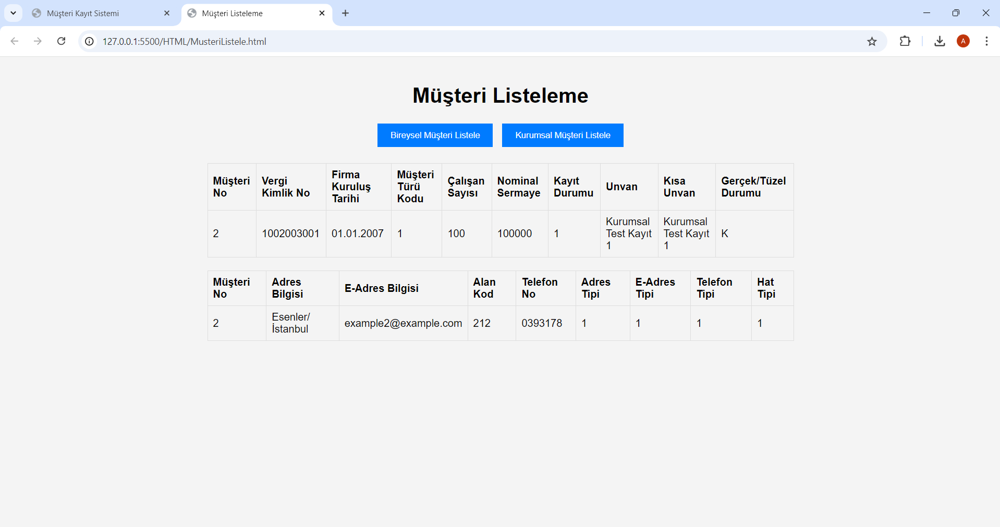

# Customer Management System for Banks

This project is a comprehensive customer management system designed for banks, supporting both individual and corporate customers. It allows for full CRUD operations via a Windows Forms application and a web interface.

## Features
- Add, update, or delete individual and corporate customer records
- Automatically generated customer numbers
- Fetch customer data based on customer number or ID
- List and manage customer information from a user-friendly interface

## Project Structure
- **Backend:** C# WebAPI
- **Frontend:** HTML, CSS, JavaScript
- **Database:** SQL Server (with scripts for creating tables, triggers, and seed data)
  
## Technologies Used
- Frontend: HTML, CSS, JavaScript
- Backend: C#, WebAPI
- Database: SQL Server

## Getting Started

### Prerequisites
- .NET SDK installed
- SQL Server installed
- Modern web browser

### Setup
1. Clone the repository:
    ```bash
    git clone https://github.com/uldagalihan/CustomerManagementSystem.git
    cd CustomerManagementSystem
    ```
2. **Backend Setup:**
   - Open the `/backend` folder in Visual Studio
   - Build and run the WebAPI project

3. **Frontend Setup:**
   - Open `AnaForm.html` in a web browser or deploy it to a web server.

4. **Database Setup:**
   - Run the scripts in the `/database` folder to set up your SQL Server database.

## Usage
1. Open the web interface or use Postman to make API calls.
2. Add, update, read, or delete customers from the UI or API.

## Screenshots




